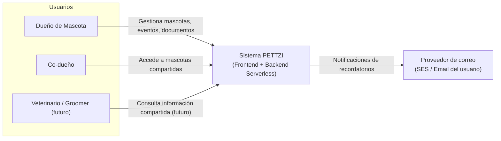
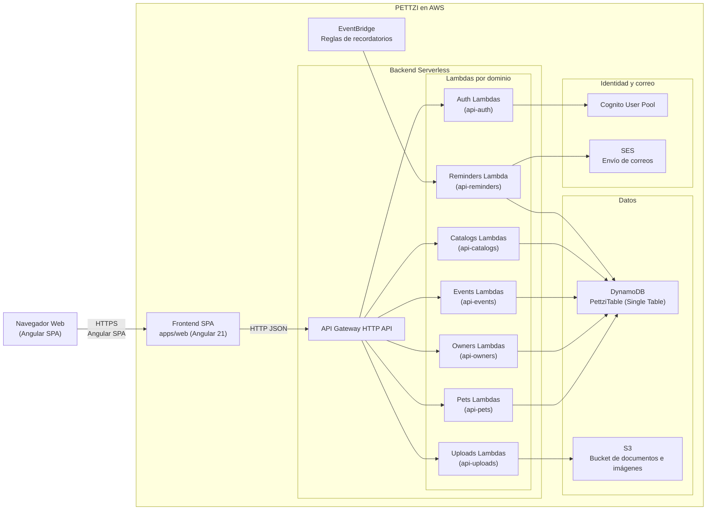
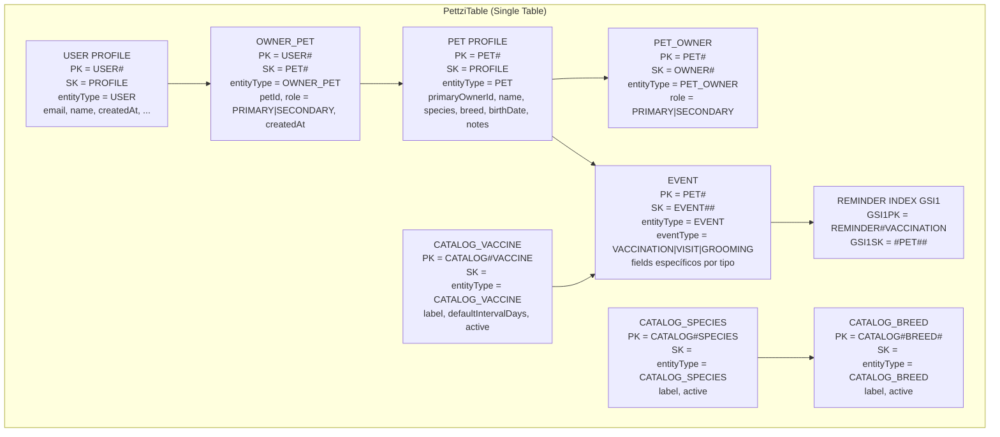
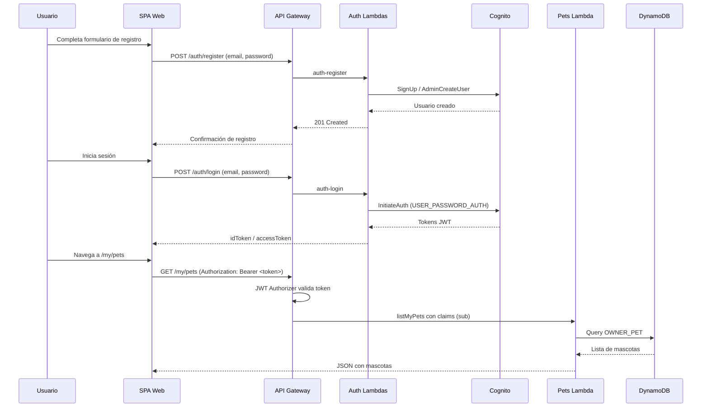
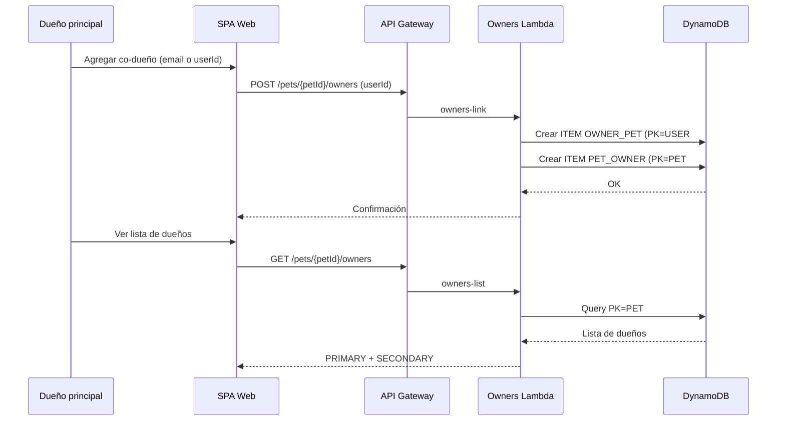
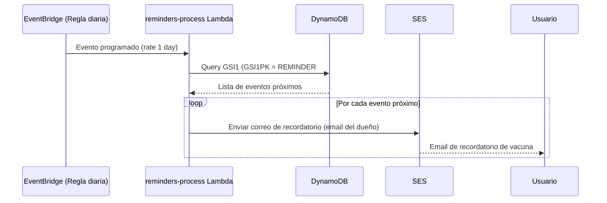

# Arquitectura de PETTZI

Este documento describe la arquitectura de alto nivel y de detalle del sistema PETTZI, utilizando el modelo C4 y diagramas adicionales para el modelo de datos y flujos principales.

---

## 1. Resumen de la arquitectura

PETTZI es una aplicación web serverless que permite gestionar información de mascotas, propietarios y eventos de salud (vacunas, visitas, grooming), con almacenamiento de documentos y recordatorios automáticos.

Componentes principales:

- Frontend SPA (Angular 21) en `apps/web`.
- Backend basado en AWS Lambda + API Gateway HTTP API.
- Almacenamiento en DynamoDB con diseño de tabla única (Single Table Design).
- Almacenamiento de archivos en Amazon S3.
- Autenticación con Amazon Cognito.
- Recordatorios con EventBridge y correos enviados con Amazon SES.
- Infraestructura declarada con AWS CDK en `apps/cdk`.

---

## 2. C4 – Nivel 1: Diagrama de Contexto

Este diagrama muestra PETTZI como sistema y los actores externos que lo usan.

## 3. C4 - Nivel 2: Diagrama de Contenedores

Este diagrama muestra los contenedores principales SPA, API, infraestructura serverless y servicios de AWS.

## 4. C4 - Nivel 3: Componentes backend (Lambadas y dominios)

Este diagrama detalla componentes lógicos en el backend: Lambdas por dominio y sus relaciones con DynamoDB y otros servicios.

```mermaid
flowchart TB

    subgraph API["API Gateway HTTP API"]
        routeAuth["Rutas /auth/*"]
        routePets["Rutas /pets/*"]
        routeOwners["Rutas /pets/:id/owners*"]
        routeEvents["Rutas /pets/:id/events*"]
        routeCatalogs["Rutas /catalogs/*"]
        routeUploads["Rutas /uploads/*"]
    end

    subgraph Auth["Módulo Auth (libs/api-auth)"]
        authRegister["Lambda auth-register\nPOST /auth/register"]
        authLogin["Lambda auth-login\nPOST /auth/login"]
        authForgot["Lambda auth-forgot-password\nPOST /auth/forgot-password"]
        authReset["Lambda auth-reset-password\nPOST /auth/reset-password"]
    end

    subgraph Pets["Módulo Pets (libs/api-pets)"]
        petsCreate["Lambda createPet\nPOST /pets"]
        petsList["Lambda listMyPets\nGET /my/pets"]
        petsGet["Lambda getPet\nGET /pets/{petId}"]
        petsUpdate["Lambda updatePet\nPUT /pets/{petId}"]
    end

    subgraph Owners["Módulo Owners (libs/api-owners)"]
        ownerLink["Lambda linkOwner\nPOST /pets/{petId}/owners"]
        ownerList["Lambda listOwners\nGET /pets/{petId}/owners"]
        ownerUpdateRole["Lambda updateOwnerRole\nPUT /pets/{petId}/owners/{ownerId}"]
    end

    subgraph Events["Módulo Events (libs/api-events)"]
        vaccCreate["Lambda createVaccination"]
        vaccList["Lambda listVaccinations"]
        visitCreate["Lambda createVisit"]
        groomCreate["Lambda createGrooming"]
        timeline["Lambda listEventsTimeline"]
    end

    subgraph Catalogs["Módulo Catalogs (libs/api-catalogs)"]
        speciesList["Lambda listSpecies"]
        breedsList["Lambda listBreedsForSpecies"]
        vaccinesList["Lambda listVaccinesCatalog"]
    end

    subgraph Uploads["Módulo Uploads (libs/api-uploads)"]
        presign["Lambda presignUpload"]
    end

    subgraph Reminders["Módulo Reminders (libs/api-reminders)"]
        remindersProcess["Lambda reminders-process"]
    end

    ddb["DynamoDB\nPettziTable"]
    s3["S3\npettzi-docs"]
    cognito["Cognito User Pool"]
    ses["SES"]
    eventBridge["EventBridge\nReglas diarias"]

    routeAuth --> authRegister
    routeAuth --> authLogin
    routeAuth --> authForgot
    routeAuth --> authReset

    routePets --> petsCreate
    routePets --> petsList
    routePets --> petsGet
    routePets --> petsUpdate

    routeOwners --> ownerLink
    routeOwners --> ownerList
    routeOwners --> ownerUpdateRole

    routeEvents --> vaccCreate
    routeEvents --> vaccList
    routeEvents --> visitCreate
    routeEvents --> groomCreate
    routeEvents --> timeline

    routeCatalogs --> speciesList
    routeCatalogs --> breedsList
    routeCatalogs --> vaccinesList

    routeUploads --> presign

    authRegister --> cognito
    authLogin --> cognito
    authForgot --> cognito
    authReset --> cognito

    petsCreate --> ddb
    petsList --> ddb
    petsGet --> ddb
    petsUpdate --> ddb

    ownerLink --> ddb
    ownerList --> ddb
    ownerUpdateRole --> ddb

    vaccCreate --> ddb
    vaccList --> ddb
    visitCreate --> ddb
    groomCreate --> ddb
    timeline --> ddb

    speciesList --> ddb
    breedsList --> ddb
    vaccinesList --> ddb

    presign --> s3

    eventBridge --> remindersProcess
    remindersProcess --> ddb
    remindersProcess --> ses
```

## 5. Modelo de datos - Single Table en DynamoDB

La tabla principal se llama PettziTable y utiliza Single Table Design.
Campos base: PK, SK, GSI1PK, GSI1SK, entityType, más atributos específicos.

## 6. Flujo de Autenticación

Flujo simplificado de registro, login y uso de JWT.

## 7. Flujo de multi-owner (co-dueños)

Flujo para agregar un co-dueño a una mascota

## 8. Flujo de recordatorios de vacunas

Flujo nocturno de EventBridge para enviar recordatorios de vacunas próximas

## 9. Stacks de CDK

Los stacks de CDK se organizan de forma modular:

	•	CoreInfraStack
	•	Define PettziTable (DynamoDB).
	•	Define bucket S3 para documentos.
	•	Configura SES (dominio o email verificado).
	•	AuthStack
	•	Define User Pool de Cognito.
	•	Define App Client.
	•	ApiAuthStack
	•	Define lambdas de auth (register, login, forgot, reset).
	•	Define rutas /auth/* en API Gateway.
	•	ApiPetsStack
	•	ApiOwnersStack
	•	ApiEventsStack
	•	ApiCatalogsStack
	•	UploadsStack
	•	RemindersStack
	•	Cada uno define sus lambdas y rutas.
	•	Todos referencian la misma tabla PettziTable.
	•	RemindersStack además crea la regla de EventBridge.

## 10. Notas de diseño
	•	Las lambdas deben usar helpers comunes ubicados en libs/utils-dynamo (para claves, respuestas HTTP, etc).
	•	Los modelos del dominio se definen en libs/domain-model y se reutilizan en distintas lambdas.
	•	El frontend se comunica únicamente con API Gateway; no accede directo a servicios de AWS.
	•	La evolución futura puede incluir:
	•	•	Roles adicionales (veterinarios, grooming shops).
	•	•	Planes de suscripción.
	•	•	Multi-tenant por organización.
## Custom domain strategy
- One HttpApi per bounded context; basePath mapping applied via ApiDomainStack.
- Base paths: /auth, /pets, /owners, /events, /reminders, /uploads, /catalogs.
- Internal routes and OpenAPI specs omit the basePath (added only at mapping).

## Email & notifications
- SES templates provisioned by SesTemplatesStack (welcome, reset, reminders).
- Auth API sends welcome/reset emails via SES (templated); Reminders processor emails due reminders.
- EventBridge scheduled rule triggers reminder processor daily.

## Infra recap (CDK)
- CoreInfraStack: DynamoDB PettziTable (single-table + GSI1), S3 docs bucket.
- AuthStack: Cognito user pool + client.
- LayersStack: SDK layers (cognito, s3, ses, ddb).
- API stacks: Auth/Pets/Owners/Events/Reminders/Uploads/Catalogs (HttpApi + Lambdas).
- SesTemplatesStack: SES templates.
- ApiDomainStack: custom domain + API mappings + Route53 alias.

For deeper docs see Mintlify under `mintlify/docs`.

## AppRegistry
- `PettziApplicationStack` define la aplicación y atributos en Service Catalog AppRegistry.
- `PettziAppRegistryAssociationsStack` asocia todos los stacks (core, auth, layers, APIs, SES, dominio) a la aplicación para observabilidad y trazabilidad.
