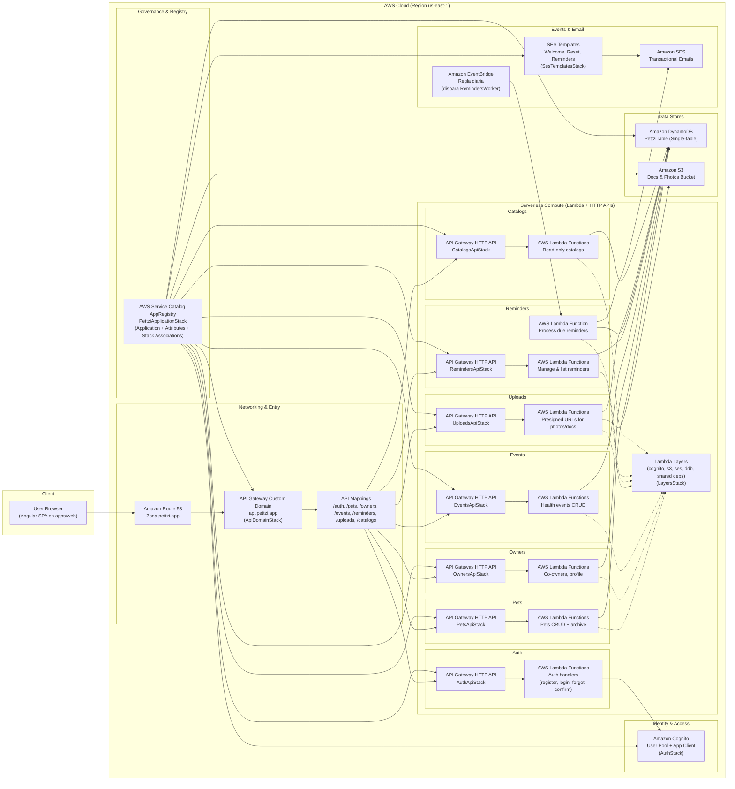

```mermaid
 flowchart LR
    %% ============================
    %% CLIENTE
    %% ============================
    subgraph Client["Client"]
        UserBrowser["User Browser\n(Angular SPA en apps/web)"]
    end

    %% ============================
    %% AWS CLOUD
    %% ============================
    subgraph AWS["AWS Cloud (Region us-east-1)"]
        
        %% --- Networking & Entry ---
        subgraph Networking["Networking & Entry"]
            Route53["Amazon Route 53\nZona pettzi.app"]
            ApiDomain["API Gateway Custom Domain\napi.pettzi.app\n(ApiDomainStack)"]
            ApiMappings["API Mappings\n/auth, /pets, /owners, /events, /reminders, /uploads, /catalogs"]
        end

        %% --- Identity & Access ---
        subgraph Identity["Identity & Access"]
            Cognito["Amazon Cognito\nUser Pool + App Client\n(AuthStack)"]
        end

        %% --- Compute: Serverless APIs ---
        subgraph Compute["Serverless Compute (Lambda + HTTP APIs)"]
            subgraph AuthApiGroup["Auth"]
                AuthApi["API Gateway HTTP API\nAuthApiStack"]
                AuthLambdas["AWS Lambda Functions\nAuth handlers\n(register, login, forgot, confirm)"]
            end

            subgraph PetsApiGroup["Pets"]
                PetsApi["API Gateway HTTP API\nPetsApiStack"]
                PetsLambdas["AWS Lambda Functions\nPets CRUD + archive"]
            end

            subgraph OwnersApiGroup["Owners"]
                OwnersApi["API Gateway HTTP API\nOwnersApiStack"]
                OwnersLambdas["AWS Lambda Functions\nCo-owners, profile"]
            end

            subgraph EventsApiGroup["Events"]
                EventsApi["API Gateway HTTP API\nEventsApiStack"]
                EventsLambdas["AWS Lambda Functions\nHealth events CRUD"]
            end

            subgraph RemindersApiGroup["Reminders"]
                RemindersApi["API Gateway HTTP API\nRemindersApiStack"]
                RemindersLambdas["AWS Lambda Functions\nManage & list reminders"]
                RemindersWorker["AWS Lambda Function\nProcess due reminders"]
            end

            subgraph UploadsApiGroup["Uploads"]
                UploadsApi["API Gateway HTTP API\nUploadsApiStack"]
                UploadsLambdas["AWS Lambda Functions\nPresigned URLs for photos/docs"]
            end

            subgraph CatalogsApiGroup["Catalogs"]
                CatalogsApi["API Gateway HTTP API\nCatalogsApiStack"]
                CatalogsLambdas["AWS Lambda Functions\nRead-only catalogs"]
            end

            LambdaLayers["Lambda Layers\n(cognito, s3, ses, ddb, shared deps)\n(LayersStack)"]
        end

        %% --- Data Stores ---
        subgraph Data["Data Stores"]
            PettziTable["Amazon DynamoDB\nPettziTable (Single-table)"]
            DocsBucket["Amazon S3\nDocs & Photos Bucket"]
        end

        %% --- Messaging, Scheduling & Email ---
        subgraph Messaging["Events & Email"]
            EventBridgeRule["Amazon EventBridge\nRegla diaria\n(dispara RemindersWorker)"]
            SES["Amazon SES\nTransactional Emails"]
            SesTemplates["SES Templates\nWelcome, Reset, Reminders\n(SesTemplatesStack)"]
        end

        %% --- Governance / Registry ---
        subgraph Governance["Governance & Registry"]
            AppRegistry["AWS Service Catalog AppRegistry\nPettziApplicationStack\n(Application + Attributes + Stack Associations)"]
        end

    end

    %% ============================
    %% FLOWS
    %% ============================

    %% Client -> DNS -> Custom Domain -> APIs
    UserBrowser --> Route53
    Route53 --> ApiDomain
    ApiDomain --> ApiMappings

    ApiMappings --> AuthApi
    ApiMappings --> PetsApi
    ApiMappings --> OwnersApi
    ApiMappings --> EventsApi
    ApiMappings --> RemindersApi
    ApiMappings --> UploadsApi
    ApiMappings --> CatalogsApi

    %% Auth
    AuthApi --> AuthLambdas
    AuthLambdas --> Cognito

    %% Pets
    PetsApi --> PetsLambdas
    PetsLambdas --> PettziTable
    PetsLambdas -.-> LambdaLayers

    %% Owners
    OwnersApi --> OwnersLambdas
    OwnersLambdas --> PettziTable
    OwnersLambdas -.-> LambdaLayers

    %% Events
    EventsApi --> EventsLambdas
    EventsLambdas --> PettziTable
    EventsLambdas -.-> LambdaLayers

    %% Reminders API (gestión)
    RemindersApi --> RemindersLambdas
    RemindersLambdas --> PettziTable
    RemindersLambdas -.-> LambdaLayers

    %% Reminders Worker (batch diario)
    EventBridgeRule --> RemindersWorker
    RemindersWorker --> PettziTable
    RemindersWorker --> SES
    RemindersWorker -.-> LambdaLayers

    %% Uploads
    UploadsApi --> UploadsLambdas
    UploadsLambdas --> DocsBucket
    UploadsLambdas --> PettziTable
    UploadsLambdas -.-> LambdaLayers

    %% Catalogs
    CatalogsApi --> CatalogsLambdas
    CatalogsLambdas --> PettziTable
    CatalogsLambdas -.-> LambdaLayers

    %% SES Templates
    SesTemplates --> SES

    %% Governance associations (lógico)
    AppRegistry --> Cognito
    AppRegistry --> PettziTable
    AppRegistry --> DocsBucket
    AppRegistry --> AuthApi
    AppRegistry --> PetsApi
    AppRegistry --> OwnersApi
    AppRegistry --> EventsApi
    AppRegistry --> RemindersApi
    AppRegistry --> UploadsApi
    AppRegistry --> CatalogsApi
    AppRegistry --> ApiDomain
    AppRegistry --> SesTemplates
```